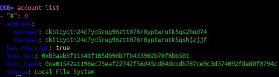
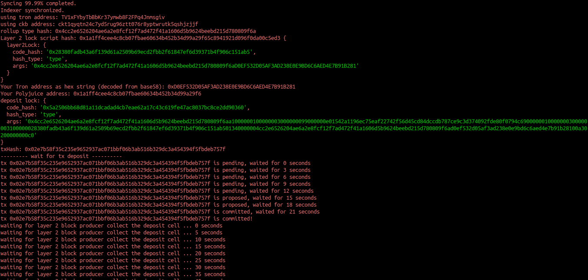
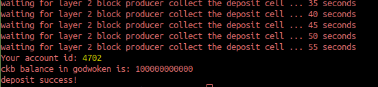
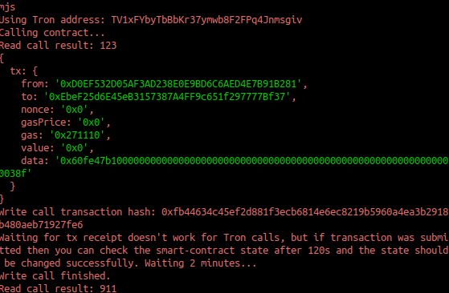

# 11 Tron wallet Call

1. A screenshot of the accounts you created (account list) in ckb-cli:



2. A link to the Layer 1 address you funded on the Testnet Explorer:

https://explorer.nervos.org/aggron/address/ckt1qyqtn24c7yd5rug96ztt076r8yptwrutk5qshjzjjf

3. A screenshot of the console output immediately after you have successfully submitted a CKByte deposit to your Tron account on Layer 2:




4. A screenshot of the console output immediately after you have successfully issued a smart contract calls on Layer 2:



5. The transaction hash of the "Contract call" from the console output (in text format):
```
0xfb44634c45ef2d881f3ecb6814e6ec8219b5960a4ea3b2918b480aeb71927fe6
```

6. The contract address that you called (in text format):
```
0xEbeF25d6E45eB3157387A4FF9c651f297777Bf37
```

7. The ABI for contract you made a call on (in text format):
```
[
    {
      "inputs": [],
      "stateMutability": "payable",
      "type": "constructor"
    },
    {
      "inputs": [
        {
          "internalType": "uint256",
          "name": "x",
          "type": "uint256"
        }
      ],
      "name": "set",
      "outputs": [],
      "stateMutability": "payable",
      "type": "function"
    },
    {
      "inputs": [],
      "name": "get",
      "outputs": [
        {
          "internalType": "uint256",
          "name": "",
          "type": "uint256"
        }
      ],
      "stateMutability": "view",
      "type": "function"
    }
]
```

8. Your Tron Address:

TV1xFYbyTbBbKr37ymwb8F2FPq4Jnmsgiv
