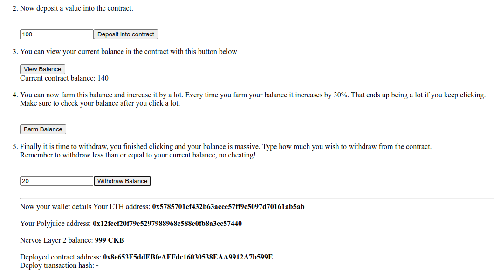

# 7 Port an ethereum dapp to polyjuice

# Screenshots of the application




# Github Repository 


# Smart Contract Information

Address: 0x8e653F5ddEBfeAFFdc16030538EAA9912A7b599E

Transaction Hash: 0xf7fefcecf4fc139c55b2866571cdcdc8b21803aac9cc168676147cbbf538b045

ABI:
```
"abi": [
        {
            "inputs": [],
            "name": "balanceReceived",
            "outputs": [
                {
                    "internalType": "int256",
                    "name": "",
                    "type": "int256"
                }
            ],
            "stateMutability": "view",
            "type": "function"
        },
        {
            "inputs": [
                {
                    "internalType": "int256",
                    "name": "depositValue",
                    "type": "int256"
                }
            ],
            "name": "Deposit",
            "outputs": [],
            "stateMutability": "payable",
            "type": "function"
        },
        {
            "inputs": [],
            "name": "farmBalance",
            "outputs": [],
            "stateMutability": "payable",
            "type": "function"
        },
        {
            "inputs": [
                {
                    "internalType": "int256",
                    "name": "withdrawValue",
                    "type": "int256"
                }
            ],
            "name": "withdrawBalance",
            "outputs": [],
            "stateMutability": "payable",
            "type": "function"
        },
        {
            "inputs": [],
            "name": "getDepositBlock",
            "outputs": [
                {
                    "internalType": "uint256",
                    "name": "",
                    "type": "uint256"
                }
            ],
            "stateMutability": "view",
            "type": "function"
        },
        {
            "inputs": [],
            "name": "currentBalance",
            "outputs": [
                {
                    "internalType": "int256",
                    "name": "",
                    "type": "int256"
                }
            ],
            "stateMutability": "view",
            "type": "function"
        }
    ],
```
